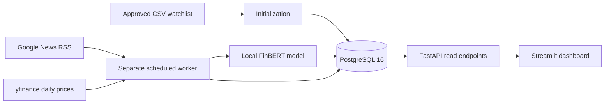

# Indian Stock News Sentiment

A demo for Indian stock prices, company news, and headline sentiment.
The first release targets 20 stocks from the Nifty 50 universe.
The watchlist will control stock coverage without code changes.

**Current status:** repository foundation and official-source watchlist import complete.
The API, worker, database, dashboard, and Docker setup do not exist yet.
The watchlist contains 20 company rows from the official Nifty 50 export.
No live prices, news, model files, or database records have been collected.

**Deadline:** 10 October 2026, 12:00 IST (06:30 UTC).

## Why this project exists

The project puts stock news and model-generated sentiment in one dashboard.
It helps users inspect recent headlines for a selected company.
It does not predict returns or provide investment advice.

## Planned architecture



The worker collects and scores data outside the API process.
PostgreSQL keeps the last successful results when a provider fails.
The API reads stored data instead of running model inference during requests.
The dashboard uses the API, not direct database queries.

## Technology choices and reasons

| Module | Choice | Reason |
| --- | --- | --- |
| Prices | `yfinance` and `.NS` tickers | No API key is required. Keep cached results because the source is unofficial. |
| News | Google News RSS, `en-IN` | Provides India-focused company news without an API key. |
| Sentiment | `ProsusAI/finbert`, CPU inference | Uses a finance-trained model. Download the model before the demo. |
| API | FastAPI and Pydantic | Validates requests and responses. Provides OpenAPI documentation. |
| Storage | SQLAlchemy and PostgreSQL 16 | Supports persistent records, constraints, and transactions. |
| Worker | APScheduler in a separate process | Prevents collection and inference from delaying API requests. |
| Dashboard | Streamlit | Provides a small dashboard without a separate JavaScript application. |
| Packaging | Docker Compose | Will start five services with a consistent configuration. |

## Repository structure

```text
stock-news-sentiment-analysis/
├── README.md
├── CONTRIBUTING.md
├── pyproject.toml
├── requirements.txt
├── .env.example
├── src/stock_sentiment/
│   ├── providers/       # Official-source adapter
│   └── ingestion/      # Explicit watchlist operations
├── dashboard/           # Streamlit interface, added after the API checkpoint
├── data/                # Approved watchlist and provenance receipt
├── scripts/             # Explicit verification and maintenance commands
├── tests/               # Unit, integration, and model test guidance
└── docs/
    ├── architecture.md
    ├── execution-log.md
    ├── setup.md
    └── reference/build-guide.md
```

The `src` layout prevents accidental imports from the working directory.
It also gives the API and worker one installable application package.
The uploaded guide uses `app/`; this project uses `src/stock_sentiment/` instead.
Module commands will use `stock_sentiment` after package installation.
The implementation preserves the guide's technology choices and checkpoint order.

## Setup and execution

Start with [setup guidance](docs/setup.md).
Do not run Docker or data commands before approval.

The planned production command is `docker compose up --build`.
**This command is not available yet.** Docker files require a separate approval.
The planned dashboard port is `8501`; the planned API port is `8000`.

Dependency ranges live in `pyproject.toml`.
`requirements.txt` selects the API, worker, and dashboard dependencies.
CPU-only PyTorch requires a separate installation from its official CPU index.
The dependency set is not installed or verified yet.
We will pin tested deployment versions before a Docker build.

## Official-source watchlist

Source: <https://www.niftyindices.com/IndexConstituent/ind_nifty50list.csv>.
The approved download succeeded on 9 October 2026 at 13:35 UTC.
The source contained 50 unique constituents and all 20 approved demo symbols.

`data/watchlist.csv` preserves the official company names.
`data/watchlist.source.json` records the source URL, retrieval time, selection method, and hashes.
The raw downloaded source stays in ignored runtime storage.
No mock company rows enter the watchlist.

The selected 20 stocks form an explicit demo subset, not a market-cap ranking.
The importer derives Yahoo tickers with the `.NS` suffix.
**Live Yahoo ticker checks have not run.** Official constituent membership does not prove Yahoo availability.
The user paused live ticker checks. No ticker-check dependencies were installed.
The guide's ticker checkpoint remains incomplete, so backend data building has not started.
The CSV contains company metadata, not price history.

The provider adapter validates the official schema, uniqueness, and 50-row count.
The importer rejects changed source hashes and missing approved stocks.
It does not substitute invented rows or switch sources after a failed request.
See [watchlist operation commands](docs/setup.md#official-watchlist-operations).

## Planned API endpoints

| Endpoint | Purpose |
| --- | --- |
| `GET /health` | Checks API and database readiness. |
| `GET /api/v1/stocks` | Lists covered stocks and cached prices. |
| `GET /api/v1/stocks/{symbol}/news` | Lists headlines with an optional sentiment filter and pagination. |
| `GET /api/v1/stocks/{symbol}/sentiment-summary` | Counts sentiment labels for a bounded time window. |
| `GET /api/v1/news` | Lists recent headlines across the watchlist. |
| `GET /docs` | Provides the interactive API documentation. |

These endpoints are a contract target, not implemented functionality.

## Approval and Git rules

- Request approval before each Docker installation, build, or startup operation.
- Request approval before each data preparation, download, initialization, or ingestion operation.
- Describe the command, reason, network access, and storage changes before approval.
- Treat an approval as permission for the named operation only.
- Do not run live-data or model tests without the required approval.
- Commit each completed feature on a `vorflux/` branch after its checks pass.
- Push each completed feature to the confirmed remote, not one final bulk upload.
- Keep unfinished features on branches instead of merging them into `main`.
- Keep `.env`, model files, database backups, and runtime data out of Git.
- Update this README and the execution log at each checkpoint.

The connected checkout has an `origin` remote.
The confirmed destination is `https://github.com/Chandansahu18/stock-news-sentiment-analysis`.
Publish the completed foundation on `main` and the watchlist feature on its own branch.
Commit author and committer settings use the project owner's identity.
Commit identity does not change the account that authenticates a push.
The configured push credential belongs to a GitHub App installation.
The user explicitly authorizes the connected GitHub App to publish and create pull requests.
GitHub can record the App as the pusher or pull request author.
All commits retain the owner's name and email.
This approval does not authorize live ticker checks, further data operations, or Docker operations.
The earlier Git bundle remains a snapshot for optional manual publication.
See [personal-account publishing instructions](docs/publish-from-your-account.md) for that alternative.
The foundation is published on `main`.
The official-source watchlist is integrated into `main` after explicit user approval.
Pull request history: `https://github.com/Chandansahu18/stock-news-sentiment-analysis/pull/1`.
Delete completed remote feature branches only after their commits are preserved on `main`.
The full application is not complete. Live ticker checks and Docker operations remain paused.

## Limitations

- This demo does not cover all NSE stocks.
- Initial coverage is 20 stocks, subject to approved ticker verification.
- Prices are last available daily closes, not real-time market ticks.
- Successful retrieval does not make an old market close current.
- Free sources can delay, limit, or stop requests.
- FinBERT scores headlines, not complete articles or investment quality.
- Live prices and news still need network access.
- A local model and stored database records support a limited offline demo.
- Store timestamps in UTC. Show timestamps in IST in the dashboard.
- The uploaded guide's dependency versions are historical examples, not a verified lock.

## Next checkpoints

1. Obtain approval for the live ticker verification operation.
2. Implement the backend modules and pass the stored-data checkpoint.
3. Implement and verify the API, then the dashboard.
4. Obtain approval for each Docker operation.
5. Verify the stack and obtain approval for the database backup operation.
6. Record the working dashboard and rehearse the demo.

See [module explanations](docs/architecture.md) and the [execution log](docs/execution-log.md).
